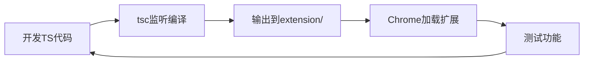
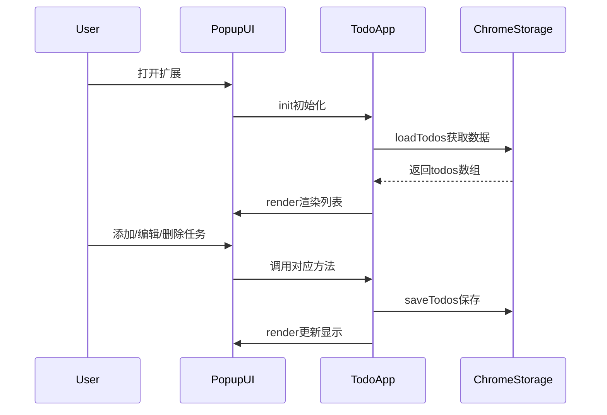

# TypeScript Chrome Todo扩展开发计划

## 项目结构

```
10dos/
├── src/
│   ├── popup.ts          # 核心业务逻辑
│   ├── popup.html        # 弹窗界面
│   ├── types.ts          # TypeScript类型定义
│   └── styles/
│       └── popup.css     # 纯CSS样式
├── extension/            # 编译输出目录
│   ├── manifest.json     # Chrome扩展配置
│   ├── popup.html
│   ├── popup.js
│   ├── styles/
│   │   └── popup.css
│   └── icons/           # 扩展图标（16/48/128）
├── tsconfig.json         # TypeScript配置
├── package.json          # 项目依赖
└── README.md            # 项目说明
```

## 核心功能实现

### 1. 类型定义 (`src/types.ts`)
定义Todo数据结构和存储接口：
- `Todo`: id, text, completed, createdAt
- `TodoStorage`: chrome.storage数据结构

### 2. 业务逻辑 (`src/popup.ts`)
使用类封装实现：
- `TodoApp`类管理所有逻辑
- 使用`chrome.storage.sync` API持久化
- CRUD操作：addTodo, toggleTodo, deleteTodo
- DOM操作：render, bindEvents

### 3. UI界面 (`src/popup.html`)
极简布局：
- 顶部输入框（带回车监听）
- 任务列表容器（可滚动）
- 每个任务：复选框 + 文本 + 删除按钮

### 4. 样式设计 (`src/styles/popup.css`)
极简风格：
- 固定宽度（360px），限制高度
- 简单的颜色方案（黑白灰为主）
- 基础hover/focus状态
- 已完成任务：删除线 + 灰色
- 无复杂动画，保持轻量

### 5. 扩展配置 (`extension/manifest.json`)
- Manifest V3
- 权限：仅storage
- action配置：popup.html
- 图标配置

## TypeScript配置

**tsconfig.json**关键配置：
- target: ES2020
- outDir: ./extension
- rootDir: ./src
- strict: true
- types: ["chrome"]

**package.json**脚本：
- `build`: 一次性编译
- `watch`: 监听模式开发

## 开发流程



## 数据流设计



## 关键技术点

1. **TypeScript类型安全**：完整的类型定义，编译时检查
2. **Chrome Storage API**：使用sync存储，支持Chrome账号同步
3. **事件委托**：任务列表使用事件委托处理点击
4. **即时保存**：每次操作立即持久化
5. **简洁构建**：仅用tsc编译，无打包工具

## 扩展图标

需要准备3个尺寸的图标文件：
- icon16.png (16x16)
- icon48.png (48x48)  
- icon128.png (128x128)

可使用简单的几何图形设计（如勾选框图标）